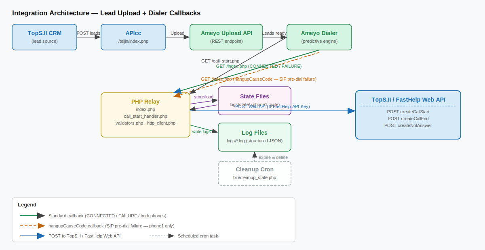
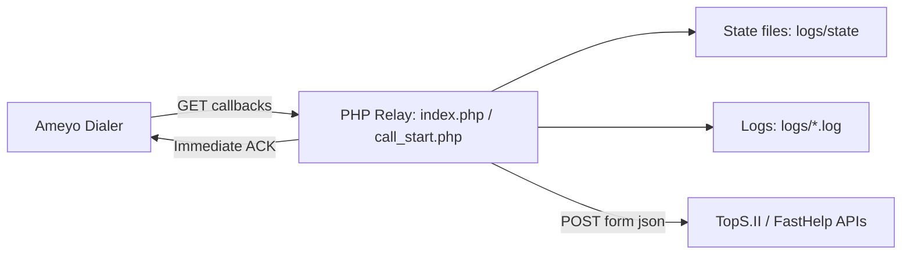
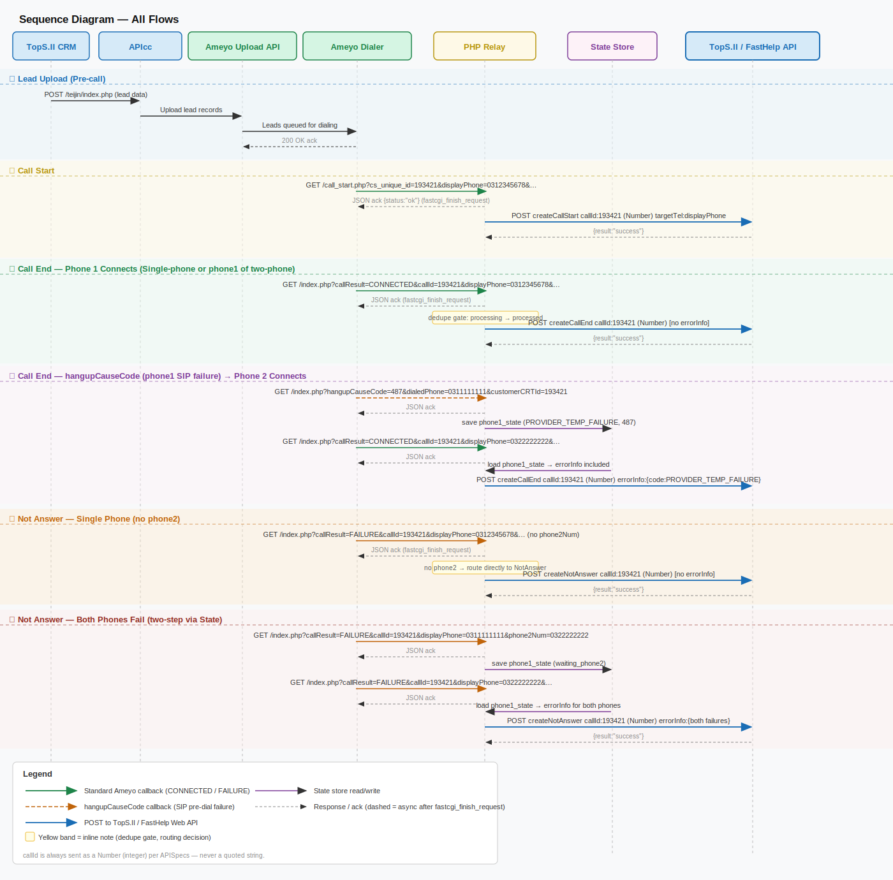
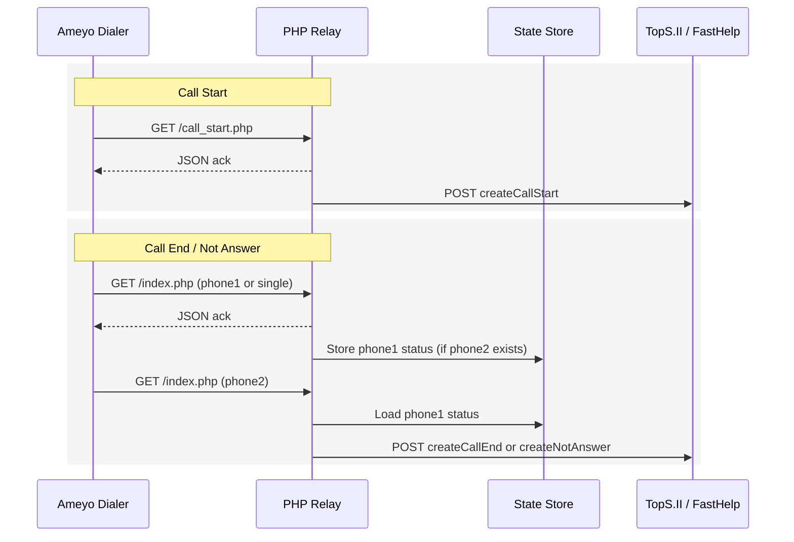

# Integration Architecture and Operational Notes

This document describes the end-to-end integration between Ameyo and TopS.II (FastHelp) via this PHP relay, including data flows, decision logic, state handling, and practical debugging steps.

## System overview

The relay receives GET callbacks from Ameyo, immediately returns a small JSON acknowledgment, and then asynchronously forwards the appropriate payload to TopS.II Web APIs.

Key integrations:
- Ameyo Dialer (callback source)
- This PHP relay (routing, state, dedupe, logging)
- TopS.II / FastHelp Web APIs (createCallStart / createCallEnd / createNotAnswer)

## Architecture diagram (image)

## Architecture diagram (Mermaid source)

## Sequence diagram (image)

## Sequence diagram (Mermaid source)

## Main components

- Ameyo Dialer
  - Sends GET callbacks per call attempt and call events.
  - Provides parameters like `unique_id`, `customerCRTId`, `shareablePhonesDialIndex`, `phoneList`, `systemDisposition`.

- PHP Relay
  - `index.php` -> `handle_index_request()` (Call End / Not Answer routing)
  - `call_start.php` -> `handle_call_start_request()` (Call Start)
  - Dedupe gate prevents duplicate upstream calls.
  - Phone1 state storage used to combine phone1+phone2 in two-phone flows.

- TopS.II / FastHelp API endpoints
  - `createCallStart.json`
  - `createCallEnd.json`
  - `createNotAnswer.json`

## Primary flows

### Call Start (`call_start.php`)

- Trigger: Ameyo sends call-start callback.
- Mapping:
  - `callId` from `callId` or `cs_unique_id` or `crm_push_generated_time` or `sessionId`
  - `predictiveStaffId` from `userId`
  - `targetTel` from `phone` or `displayPhone` or `dialledPhone` or `dstPhone`
- Action: Send `createCallStart` to TopS.II.

### Call End / Not Answer (`index.php`)

Decision inputs:
- `systemDisposition` and `dispositionCode`
- `shareablePhonesDialIndex`
- `phoneList` (JSON)
- `customerCRTId` (required for Call End)

Routing rules:
- Phone1 connected (`systemDisposition=CONNECTED` and `shareablePhonesDialIndex=0`):
  - Send `createCallEnd` with `subCtiHistoryId = customerCRTId`.
- Phone2 connected (`systemDisposition=CONNECTED` and `shareablePhonesDialIndex>=1`):
  - Send `createCallEnd` with phone1 errorInfo (from state) and `subCtiHistoryId = customerCRTId`.
- Not connected:
  - Single phone: send `createNotAnswer` immediately with `errorInfo1 = current status`.
  - Two phones:
    - Phone1 callback (dialIndex=0): store phone1 status and wait.
    - Phone2 callback (dialIndex>=1): combine stored phone1 status + current phone2 status and send `createNotAnswer`.

## State handling (two-phone flow)

Purpose: Avoid DB timing issues by keeping phone1 status locally until phone2 arrives.

- State file stored under `logs/state/phone1_<hash>.json`
- Key: `customerId + callId`
- Fields: `customerId`, `callId`, `callTime`, `phone1Status`
- TTL: `PHONE1_STATE_TTL_SECONDS` (default 600s)
- Cleared after sending phone2-based upstream request

## Dedupe gate

Purpose: Prevent multiple upstream calls for the same callback retry.

- Key: `crtObjectId + customerId + callId`
- Status:
  - `processing`: rejects duplicates for a short window
  - `processed`: rejects duplicates for a longer window
- TTL:
  - `REQUEST_PROCESSING_TTL_SECONDS` (default 30s)
  - `REQUEST_DEDUPE_TTL_SECONDS` (default 300s)

## Configuration (env)

- `TEST_BASE_URL` / `PROD_BASE_URL`
- `TEST_API_KEY` / `PROD_API_KEY`
- `INDEX_ENV` (`TEST` or `PROD`)
- `ENABLE_REAL_SEND` (`true` to send upstream)
- `PHONE1_STATE_TTL_SECONDS`
- `REQUEST_PROCESSING_TTL_SECONDS`
- `REQUEST_DEDUPE_TTL_SECONDS`

## Logging

Log files (daily):
- `logs/call_start-YYYY-MM-DD.log`
- `logs/call_end-YYYY-MM-DD.log`
- `logs/not_answer-YYYY-MM-DD.log`
- `logs/general-YYYY-MM-DD.log`

Each entry contains:
- `request_id` for correlation
- `query` payload from Ameyo
- `decision` with chosen flow and errorInfo values
- `upstream_request` / `http_client` / `upstream_response`
- `dedupe` if a retry was skipped
- `state` when phone1 is stored

## Debugging checklist (CRM-side first)

1) Verify Ameyo callback inputs:
   - `unique_id`, `customerId`, `customerCRTId`, `shareablePhonesDialIndex`, `phoneList`
   - Confirm `systemDisposition` and `dispositionCode` values
2) Confirm relay received the request:
   - Check `logs/not_answer-YYYY-MM-DD.log` or `logs/call_end-YYYY-MM-DD.log`
   - Use `request_id` to track a single flow
3) Check dedupe behavior:
   - Look for `dedupe | Skipped duplicate request`
4) Check phone1 state behavior (two-phone flow):
   - `state | Stored phone1 status; waiting for phone2`
   - On phone2 callback, confirm `phone1_state_used=true` in decision log
5) Check upstream send:
   - `upstream_request` contains payload and URL
   - `http_client` shows `http_code` and `error` if any
6) If upstream returns errors:
   - Confirm `customerCRTId` exists in CRM
   - Validate `callId`, `callTime`, `predictiveStaffId`, `targetTel`

## Known edge cases and handling

- Duplicate callbacks from Ameyo:
  - Handled by dedupe gate; only first request is sent upstream.
- Phone2 arrives before phone1:
  - `errorInfo1` will be `UNKNOWN` (no phone1 state available).
- Phone2 never arrives:
  - Phone1 state expires after `PHONE1_STATE_TTL_SECONDS`.
- Missing `customerCRTId` on Call End:
  - Request is rejected with a clear error.

## Change management notes

- Database lookups are intentionally removed to avoid timing inconsistencies.
- Phone1 status is sourced only from the phone1 callback and stored locally.
- NotAnswer does not include `subCtiHistoryId`.
