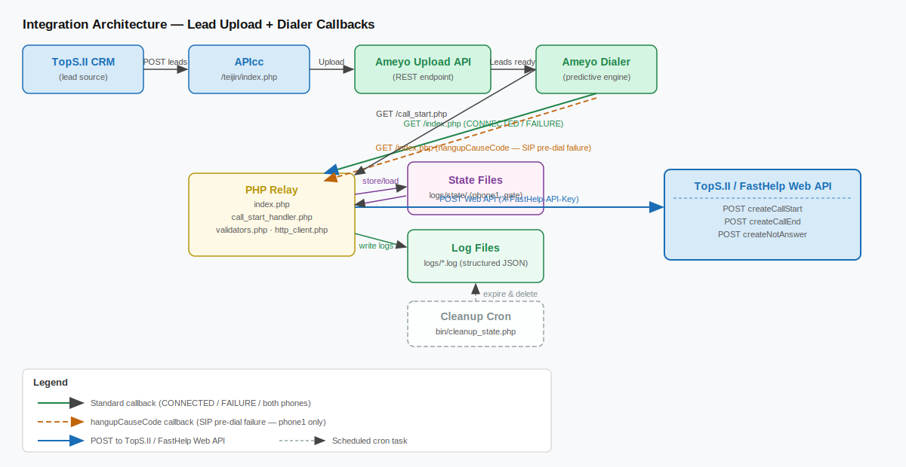
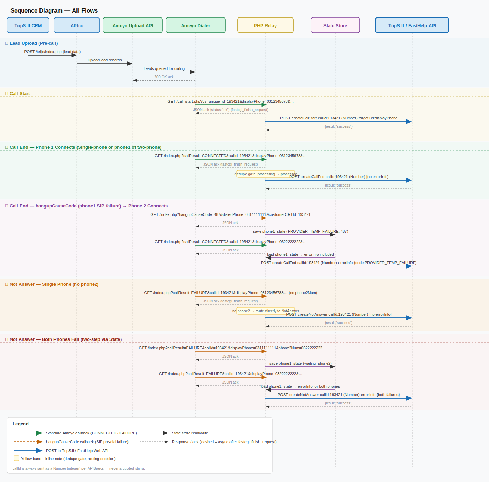

# Integration Architecture and Operational Notes

This document describes the end-to-end integration between TopS.II (FastHelp) and Ameyo via APIcc and this PHP relay, including data flows, decision logic, state handling, and practical debugging steps.

---

## System overview

Before dialing starts, TopS.II uses APIcc to upload lead data into Ameyo. After that, Ameyo starts auto-dialing based on campaign settings. During dialing, the relay receives GET callbacks from Ameyo, immediately returns a small JSON acknowledgment, and then asynchronously forwards the appropriate payload to the TopS.II Web APIs.

Key systems:
- **TopS.II CRM** — lead source and final destination of call records
- **APIcc** — lead upload bridge from TopS.II into Ameyo
- **Ameyo Dialer** — predictive dialing engine; sends GET callbacks to this relay
- **This PHP relay** — routing, state management, deduplication, logging
- **TopS.II / FastHelp Web APIs** — `createCallStart` / `createCallEnd` / `createNotAnswer`

---

## Architecture diagram



## Sequence diagram



---

## Main components

### APIcc (lead upload)
- Endpoint: `POST /teijin/index.php` with `X-API-Key` header
- Uploads phone records into Ameyo before dialing starts
- Body includes `customerRecords[]` with required `phone`, `unique_id`, `type` (leadId), optional `phone2`

### Ameyo Dialer
- Sends GET callbacks per call attempt and per call event to this relay
- Provides key parameters: `unique_id`, `customerCRTId`, `shareablePhonesDialIndex`, `phoneList`, `systemDisposition`, `hangupCauseCode`
- Two distinct callback types:
  - **Standard callback** — full params including `systemDisposition`, `callResult`, `callConnectedTime`
  - **hangupCause callback** — abbreviated; includes only `hangupCauseCode`, `dialedPhone`, `customerCRTId` (signals a pre-dial phone1 SIP failure)

### PHP Relay
- `index.php` → `handle_index_request()` — routes to Call End or Not Answer
- `call_start.php` → `handle_call_start_request()` — handles Call Start
- Dedupe gate prevents duplicate upstream calls when Ameyo retries
- Phone1 state storage combines phone1 + phone2 failure status in two-phone flows

### TopS.II / FastHelp API endpoints
- `createCallStart.json` — pops up the call on the operator's screen at call start
- `createCallEnd.json` — registers call termination information
- `createNotAnswer.json` — registers non-answered or failed call information

---

## Pre-call lead upload flow (TopS.II → APIcc → Ameyo)

1. TopS.II (or a feeder system) sends leads to APIcc using the upload endpoint.
2. APIcc validates the `X-API-Key` and ingests the lead data into Ameyo.
3. Once leads exist in Ameyo, the dialer starts auto-dialing based on configured campaign rules.

---

## Primary flows

### Call Start (`call_start.php`)

Triggered when Ameyo connects to a customer and pops the screen on the operator's desktop.

**Field mapping:**

| Ameyo field | TopS.II field | Notes |
|-------------|---------------|-------|
| `cs_unique_id` (fallback: `callId`, `crm_push_generated_time`, `sessionId`) | `callId` (Number) | First non-empty value wins |
| `userId` | `predictiveStaffId` | Required |
| `displayPhone` | `targetTel` | Only `displayPhone` is used |

**Payload sent to TopS.II:**
```json
{
  "predictiveCallCreateCallStart": {
    "callId": 99999999,
    "predictiveStaffId": "ABCD1234",
    "targetTel": "03000000001"
  }
}
```

> `callId` is always sent as a JSON **Number** (integer) per the TopS.II API spec (`callId: Number`).

---

### Call End / Not Answer (`index.php`)

**Decision inputs:**

| Field | Purpose |
|-------|---------|
| `systemDisposition` | Whether the call connected (`CONNECTED`) or failed |
| `shareablePhonesDialIndex` | 0 = phone1 attempt, 1+ = phone2 attempt |
| `phoneList` | JSON array of phone numbers for this customer |
| `hangupCauseCode` | Numeric SIP cause code — signals a pre-dial phone1 failure |
| `customerCRTId` | Required for Call End — becomes `subCtiHistoryId` |

**Routing decision table:**

| `systemDisposition` | `dialIndex` | `hangupCauseCode` | Phones | Action |
|--------------------|------------|-------------------|--------|--------|
| `CONNECTED` | 0 | — | Any | `createCallEnd` (no errorInfo) |
| `CONNECTED` | ≥ 1 | — | ≥ 2 | `createCallEnd` + phone1 errorInfo from state |
| Not connected | 0 | — | 1 | `createNotAnswer` with `errorInfo1` |
| Not connected | 0 | — | 2 | Store phone1 status → wait for phone2 |
| Not connected | ≥ 1 | — | 2 | `createNotAnswer` with `errorInfo1` + `errorInfo2` |
| Any | 0 | Present | 2 | Treat as phone1 failure → store status → wait for phone2 |

**hangupCauseCode mapping (examples):**

| SIP Code | Meaning | Maps to |
|----------|---------|---------|
| 487 | Request Terminated | `PROVIDER_TEMP_FAILURE` |
| 603 | Decline | `NUMBER_TEMP_FAILURE` |
| Others | See `src/hangup_cause_map.php` | Various |

---

### createCallEnd payload

Sent for all CONNECTED calls. `callId` is always a Number.

```json
{
  "predictiveCallCreateCallEnd": {
    "callId": 99999999,
    "callStartTime": "2026-03-06 13:20:05",
    "callEndTime":   "2026-03-06 13:21:02",
    "subCtiHistoryId": "d336-69a6d5e5-vce-101",
    "targetTel": "08099366675",
    "predictiveStaffId": "teijin_sv2",
    "errorInfo": "PROVIDER_TEMP_FAILURE"
  }
}
```

> `errorInfo` is **only included** when phone2 connected and phone1 had previously failed. It is omitted for single-phone calls and for phone1-connected calls.

**Field sources:**

| TopS.II field | Source |
|---------------|--------|
| `callId` | `unique_id` (cast to int) |
| `callStartTime` | `callConnectedTime` (converted from Ameyo format `YYYY/MM/DD HH:mm:ss +0900`) |
| `callEndTime` | Processing timestamp at time of callback |
| `subCtiHistoryId` | `customerCRTId` |
| `targetTel` | `dialledPhone` / `dialedPhone` (phone1) or `cstmPhone` (phone2) |
| `predictiveStaffId` | `userId` |
| `errorInfo` | Phone1 failure status from state file |

---

### createNotAnswer payload

Sent when all phone attempts fail. `callId` is always a Number.

```json
{
  "predictiveCallCreateNotAnswer": {
    "callId": 99999999,
    "callTime": "2026-03-06 13:53:54",
    "errorInfo1": "PROVIDER_TEMP_FAILURE",
    "errorInfo2": "CALL_DROP"
  }
}
```

> `errorInfo2` is **only included** when a second phone was attempted and also failed.

**Field sources:**

| TopS.II field | Source |
|---------------|--------|
| `callId` | `unique_id` (cast to int) |
| `callTime` | Processing timestamp at time of callback |
| `errorInfo1` | Phone1 `systemDisposition` or hangupCauseCode-mapped value |
| `errorInfo2` | Phone2 `systemDisposition` (only when dialIndex ≥ 1) |

---

## State handling — two-phone flow

Purpose: Store the phone1 failure reason locally so it can be included when the phone2 callback is processed.

| Detail | Value |
|--------|-------|
| Storage location | `logs/state/phone1_<sha1>.json` |
| Key | `sha1(customerId + "|" + callId)` |
| Stored fields | `customerId`, `callId`, `callTime`, `phone1Status`, `updatedAt` |
| TTL | `PHONE1_STATE_TTL_SECONDS` (default: 600s) |
| Cleared | Immediately after phone2 upstream request is sent |

**Two-phone Not Answer sequence:**
```
1. Phone1 callback (dialIndex=0, FAILURE)
   → phone1Status stored in logs/state/phone1_<hash>.json
   → waiting for phone2

2. Phone2 callback (dialIndex=1, FAILURE)
   → phone1 state loaded
   → createNotAnswer sent with errorInfo1 (phone1) + errorInfo2 (phone2)
   → state file deleted
```

**Two-phone Call End sequence (via hangupCauseCode):**
```
1. hangupCauseCode callback for phone1
   → phone1Status derived from SIP code (e.g. 487 → PROVIDER_TEMP_FAILURE)
   → stored in logs/state/phone1_<hash>.json

2. call_start.php callback (phone2 connects)
   → createCallStart sent

3. index.php callback (phone2 call ends, CONNECTED)
   → phone1 state loaded
   → createCallEnd sent with errorInfo = phone1Status
   → state file deleted
```

---

## Dedupe gate

Purpose: Prevent duplicate TopS.II API calls when Ameyo retries the same callback.

| Property | `index.php` | `call_start.php` |
|----------|------------|-----------------|
| Key | `sha1(crtObjectId + customerId + callId)` | `sha1(callId + staffId + targetTel)` |
| State file | `logs/state/req_<key>.json` | `logs/state/call_start_<key>.json` |
| Status: `processing` | Rejects retries while in-flight (30s window) | Same |
| Status: `processed` | Rejects duplicates after completion (300s window) | Same |
| Status: `waiting_phone2` | Allows the follow-up phone2 callback through | N/A |

---

## Configuration reference

| Variable | Default | Description |
|----------|---------|-------------|
| `TEST_BASE_URL` | — | TopS.II TEST server base URL (no trailing slash) |
| `PROD_BASE_URL` | — | TopS.II PROD server base URL (no trailing slash) |
| `TEST_API_KEY` | — | 32-char alphanumeric Web API key for TEST |
| `PROD_API_KEY` | — | 32-char alphanumeric Web API key for PROD |
| `INDEX_ENV` | `TEST` | Selects TEST or PROD environment |
| `ENABLE_REAL_SEND` | `false` | `true` sends to TopS.II; `false` for log-only mode |
| `PHONE1_STATE_TTL_SECONDS` | `600` | Seconds to retain phone1 state while awaiting phone2 |
| `REQUEST_PROCESSING_TTL_SECONDS` | `30` | In-flight dedupe window |
| `REQUEST_DEDUPE_TTL_SECONDS` | `300` | Completed-request dedupe window |

---

## Logging

Log files are written daily under `logs/`:

| File | Written when |
|------|-------------|
| `logs/call_start-YYYY-MM-DD.log` | `call_start.php` is triggered |
| `logs/call_end-YYYY-MM-DD.log` | A CONNECTED callback routes to `createCallEnd` |
| `logs/not_answer-YYYY-MM-DD.log` | A failed callback routes to `createNotAnswer` or stores phone1 state |
| `logs/general-YYYY-MM-DD.log` | Fallback / unrouted events |

**Log line format:**
```
TIMESTAMP | [REQUEST_ID] | LABEL | MESSAGE | key=value | key=value ...
```

**Key log labels:**

| Label | Meaning |
|-------|---------|
| `incoming_get` | Raw Ameyo callback received (full query params logged) |
| `decision` | Routing outcome and key values (dialIndex, errorInfo, phones) |
| `state` | Phone1 status stored or loaded from state file |
| `dedupe` | Duplicate request detected and skipped |
| `upstream_request` | Full payload and URL prepared for TopS.II |
| `payload_prepared` | Whether `ENABLE_REAL_SEND` is on or off |
| `http_client` | Raw HTTP send result (http_code, body, error) |
| `upstream_response` | Parsed TopS.II response (result: success / fail) |

---

## State file maintenance

State files expire lazily on read. To proactively clean up expired files, run:

```bash
php bin/cleanup_state.php
```

**Recommended cron (every 30 minutes):**
```
*/30 * * * * php /path/to/tops/bin/cleanup_state.php >> /path/to/tops/logs/cleanup.log 2>&1
```

The script applies a 2× grace multiplier on top of each TTL before deleting, and handles `waiting_phone2` state files correctly.

---

## Debugging checklist (CRM-side first)

**Step 1 — Verify Ameyo callback inputs**
- `index.php`: `unique_id`, `customerId`, `customerCRTId`, `shareablePhonesDialIndex`, `phoneList`, `systemDisposition`
- `call_start.php`: `userId`, one of `cs_unique_id`/`callId`/`crm_push_generated_time`, `displayPhone`
- All raw params are logged under `incoming_get`

**Step 2 — Confirm relay received the request**
- Check the relevant daily log (`call_end`, `not_answer`, or `call_start`)
- Use `request_id` to trace a single end-to-end flow across all log labels

**Step 3 — Check dedupe behavior**
- Look for `dedupe | Skipped duplicate request`
- If a valid retry is being blocked, check `REQUEST_DEDUPE_TTL_SECONDS`

**Step 4 — Check phone1 state behavior (two-phone flow)**
- Phone1 stored: `state | Stored phone1 status; waiting for phone2`
- Phone2 processed: `decision | ... resolvedPhone1=<status>` in call_end or not_answer log

**Step 5 — Check upstream send**
- `upstream_request` — full payload and URL
- `payload_prepared` — whether `send_enabled=1` or `0`
- `http_client` — `http_code` (always 200 per TopS.II spec) and any `error`
- `upstream_response` — `result: success` or `result: fail`

**Step 6 — If TopS.II returns a logical error**

| Sub-error code | Meaning | Fix |
|----------------|---------|-----|
| `WPRDEXTC3201` | Call does not exist | Verify `callId` is registered in TopS.II; `createCallStart` must be sent before `createCallEnd` |
| `WPRDEXTC3202` | Staff cannot be identified | `predictiveStaffId` (`userId`) does not match any TopS.II user |
| `WPRDEXTC3203` | Staff is not logged in | User exists but is not currently logged into TopS.II |

---

## Known edge cases

| Scenario | Behavior |
|----------|----------|
| Ameyo retries the same callback | Dedupe gate blocks the duplicate; only the first is forwarded |
| Phone2 callback arrives before phone1 | `errorInfo1` will be `UNKNOWN` (no phone1 state available) |
| Phone2 never arrives | Phone1 state expires after `PHONE1_STATE_TTL_SECONDS`; no Not Answer is sent |
| `customerCRTId` missing on Call End | Request is rejected with a logged error |
| `ENABLE_REAL_SEND=false` | Payloads are fully built and logged but not sent to TopS.II |

---

## Design decisions

- **No database dependency**: phone1 status is sourced exclusively from the phone1 callback and stored in a local state file. This avoids DB timing races where the DB might not yet reflect the phone1 outcome when the phone2 callback arrives.
- **`callId` sent as Number**: per the TopS.II API spec (`callId: Number`), the relay casts `callId` to integer before JSON encoding.
- **`displayPhone` only for Call Start**: this field reliably reflects what was shown to the agent, avoiding ambiguity with `dialledPhone` or `dstPhone`.
- **Legacy POST endpoints deprecated**: `public/test/` and `public/prod/` are retained for reference but are not part of the active callback flow.
